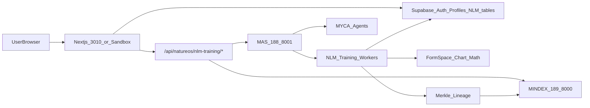

# Codex Handoff — SI / FormSpace / NLM Training — Sep 22, 2026

**Date:** 2026-09-22  
**Status:** Partial ship — marketing/docs/UI shipped; NLM training backend NOT fully real  
**Repo:** `MycosoftLabs/website`  
**Branch (ship):** `ship/si-formspace-nlm-sep22`  
**Audience:** Codex (ChatGPT) continuing after Cursor token limit  
**Hard rule:** No mock data. No mock systems. Every UI surface must use real APIs or an honest empty/unavailable state.

---

## 1. Mission for Codex (continue from here)

Make the **Nature Learning Model training system** fully functional end-to-end:

- Real math / NLM algorithms / FormSpace injection into training
- Real Supabase persistence (models, variants, jobs, preferences, user memory)
- Real MINDEX lineage + Merkle roots for every model/dataset/training artifact
- Real MAS / MYCA / VM orchestration (188 MAS, 189 MINDEX, 187 Sandbox, etc.)
- Every dashboard module wired; no Firebase leftovers, no localStorage-as-source-of-truth, no seeded fake base models as “demo”
- User retains memory of everything done inside the app

This handoff documents **what already shipped**, **what is still broken / unfinished**, and a **concrete plan** to finish it.

---

## 2. What was completed in this Cursor session (DONE)

### 2.1 Site terminology — AI → SI

User-facing Mycosoft copy renamed **Artificial Intelligence / AI → Super Intelligence / SI** across:

- Header / mobile nav / footer dropdown labels (`components/header.tsx`, `components/mobile-nav.tsx`, `components/footer.tsx`)
- SI overview page (`app/ai/page.tsx`) — routes stay `/ai/*` for URL stability
- Nav catalog (`lib/nav-ai.ts`): FormSpace subtitle = **Environmental Platonic Map**
- Homepage hero: **Operational Environmental Superintelligence** (`components/home/nlm-formspace-hero.tsx`, `components/home/hero-search.tsx`)
- Docs catalog, onboarding, shell, emails, many dashboard strings

**Preserved on purpose:** third-party names (OpenAI, etc.), technical identifiers, route paths `/ai/*`, API path segments where breaking would break clients. Admin key categories may still store `AI` internally but display as SI.

### 2.2 FormSpace white paper (canonical)

- Canonical Markdown: [`docs/ai/formspace.md`](docs/ai/formspace.md)
- Parser: [`lib/formspace-paper.ts`](lib/formspace-paper.ts) + tests [`lib/formspace-paper.test.ts`](lib/formspace-paper.test.ts)
- Renderer (KaTeX + NLM-style code/tables): [`components/docs/formspace-paper-renderer.tsx`](components/docs/formspace-paper-renderer.tsx)
- Doc page: [`app/docs/ai/formspace/page.tsx`](app/docs/ai/formspace/page.tsx) — detailed document-role panel; **scrollable** TOC matched to document-role height
- Product page excerpt: [`app/ai/formspace/page.tsx`](app/ai/formspace/page.tsx)
- Figures: `public/assets/formspace-white-paper/architecture.png`, `recovery-demo.png`
- KaTeX CSS: `app/layout.tsx` + `.formspace-technical-article` rules in `app/globals.css`
- Dependencies: `katex`, `remark-math`, `rehype-katex` in `package.json`

**Publication constraints enforced:**

- No ITDX / Army / RUN_WEKA.py demonstration language
- No fixed `25,728` parameter count (changes daily)
- FormSpace is Mycosoft-owned; Platonic space / Michael Levin may appear as **scientific context**, not as the foundation of FormSpace

### 2.3 Downloads catalog (real links or explicit pending)

- Catalog: [`lib/model-downloads.ts`](lib/model-downloads.ts)
- UI: [`components/product/product-downloads.tsx`](components/product/product-downloads.tsx) + host logos [`components/product/host-logos.tsx`](components/product/host-logos.tsx)
- Pages:
  - [`app/ai/formspace/downloads/page.tsx`](app/ai/formspace/downloads/page.tsx)
  - [`app/myca/nlm/downloads/page.tsx`](app/myca/nlm/downloads/page.tsx)
  - [`app/myca/downloads/page.tsx`](app/myca/downloads/page.tsx)
- Hosts: GitHub, Hugging Face, Mycosoft marks
- Unpublished items show **Release pending** — never fake URLs

### 2.4 Homepage cards

- Smaller card body text in [`components/home/nlm-formspace-stage.tsx`](components/home/nlm-formspace-stage.tsx)

### 2.5 NLM training UI embed (surface only)

- Removed live-arithmetic / `NatureMathStage` approach
- Extracted reusable [`components/natureos/nlm-training/NlmTrainingApplication.tsx`](components/natureos/nlm-training/NlmTrainingApplication.tsx)
- Mounted on [`app/myca/nlm/page.tsx`](app/myca/nlm/page.tsx) and [`app/natureos/model-training/page.tsx`](app/natureos/model-training/page.tsx)
- Smoke test: [`lib/nlm-training-integration.test.ts`](lib/nlm-training-integration.test.ts)

**Important:** Embedding the existing dashboard is **not** the same as making training real. Backend audit below is incomplete / failing requirements.

### 2.6 Deploy / ship (this handoff round)

- GitHub push of SI + FormSpace + downloads + NLM UI embed
- Blue-green deploy to Sandbox / production path (see section 7 for live SHA / verify results — fill after deploy completes)

---

## 3. What was NOT done (NOT DONE — Codex ownership)

### 3.1 NLM training system — not fully real

| Area | Current reality | Required |
|------|-----------------|----------|
| Model list / create | Partially wired via `/api/natureos/nlm-training/*` and hooks; **Dashboard still references `useModels` from `@/lib/nlm/firebase-hooks`** | Pure Supabase (or MINDEX) — remove Firebase path |
| Base model seed | Hardcoded list of 10 base models posted from client (`Dashboard.tsx` `seedBaseModels`) | Canonical base models from MINDEX/registry only; no client-side fake seed as product path |
| Architecture variant seed | Auto-seeds `Base-NLM-v1` once via **localStorage** flag | Server-side idempotent upsert; no localStorage as truth |
| Preferences | API exists (`/preferences`) | Verify RLS + per-user persistence |
| Training jobs / graphs / ingestion | UI modules exist (`PipelineDashboard`, `IngestionConsole`, `StateGraphConsole`, `MerkleLineageExplorer`, etc.) | Each must call real MAS/MINDEX endpoints; fail closed with empty states |
| FormSpace injection | White paper on site; **not injected into training runtime** | Training pipeline must use FormSpace chart/math from canonical paper + code services |
| Real NLM math | Not verified in training loop | Wire actual NLM selective state-space / pattern head / conformal gate implementations |
| Merkle roots | Explorer UI exists; lineage not proven end-to-end | Persist Merkle roots to MINDEX for models, datasets, training runs |
| MYCA / agents | AgentControlCenter / AvaniGuardian present | Real MAS agent tasking on 188:8001 |
| Memory retention | Auth via Supabase profiles; model memory incomplete | Every create/train/ingest event retained and queryable per user |
| VM 191 MYCA workspace | Health probe **timed out** during audit | Confirm whether required for NLM training or out of scope |

### 3.2 Mock / non-real patterns found (must eliminate)

Evidence from [`components/natureos/nlm-training/Dashboard.tsx`](components/natureos/nlm-training/Dashboard.tsx):

1. `import { useModels } from '@/lib/nlm/firebase-hooks'` — Firebase-era hook still in use  
2. `localStorage.getItem('base_variant_seeded')` — session/local fake gate for seeding  
3. Hardcoded `baseModels` array (Flora/Fauna/Funga/…) written via POST as if they were product truth  
4. Comment: “In a real app, we'd query Firestore…” — leftover mock mindset  

**Acceptance gate for Codex:** If a panel shows numbers/models/graphs that did not come from Supabase, MINDEX, MAS, or a live device/service, it is a ship blocker. Empty state OK; fake success not OK.

### 3.3 Audit started but not finished

Parallel audit was in progress when tokens ran out:

- UI module walkthrough (tabs, create model, seed variants)
- Supabase schema / RLS for NLM tables
- MINDEX Merkle / lineage APIs
- MAS MYCA NLM routers on 188
- Live health: MAS `192.168.0.188:8001/live` = alive; MINDEX `192.168.0.189:8000/health` = healthy; MYCA `192.168.0.191:8000/health` = **timeout**

Codex must complete the audit with evidence (endpoint → response → UI binding) before claiming “fully functional.”

### 3.4 Downloads / weights publication

Catalog UI is ready; many Hugging Face / weight entries remain **Release pending**. Publishing real HF/GitHub artifacts is a separate ops task (not mock — leave pending until real URLs exist).

---

## 4. Architecture target (real wiring)



**VMs (canonical):**

| Role | IP | Port |
|------|-----|------|
| Sandbox website | 192.168.0.187 | 3000 |
| MAS orchestrator | 192.168.0.188 | 8001 |
| MINDEX API | 192.168.0.189 | 8000 |
| Voice Legion | 192.168.0.241 | 8999 / 8998 |
| Earth-2 Legion | 192.168.0.249 | 8220 |

---

## 5. Concrete plan for Codex (ordered)

### Phase A — Inventory & kill mocks (day 1)

1. Map every tab in `NlmTrainingApplication` / `Dashboard` to its fetch URL.
2. Delete or quarantine `firebase-hooks` usage; migrate `useModels` to Supabase-backed hook only.
3. Remove localStorage seeding; replace with server idempotent “ensure base variant” API.
4. Remove client hard-coded base model list from product path; load bases from registry/MINDEX.
5. Grep `nlm-training` for `mock|fake|Math.random|placeholder|sample|DEMO_|localStorage` and eliminate.

### Phase B — Supabase persistence (day 1–2)

1. Confirm tables: models, variants, training_jobs, preferences, lineage_events (create migrations if missing).
2. RLS: owner read/write; admin/super_admin full; no anon writes.
3. Every Create Model / Seed Variant / Train action writes durable rows.
4. Session restore: refresh page → same models for same user.

### Phase C — MINDEX + Merkle (day 2–3)

1. On model create / checkpoint / dataset ingest: compute Merkle root, POST to MINDEX.
2. `MerkleLineageExplorer` reads only MINDEX (empty if none).
3. Store association: `model_id`, `dataset_id`, `job_id`, `merkle_root`, `created_at`, `owner_id`.

### Phase D — Real NLM + FormSpace in training (day 3–5)

1. Locate existing NLM math/services in MAS / NLM repo (`MAS/NLM`, MAS routers).
2. Inject FormSpace chart coordinates / comparison rules into training config and loss / evaluation.
3. Training job API starts real worker (not UI timer).
4. Graphs/metrics stream from job logs or Redis/Postgres — never random.

### Phase E — MAS / MYCA / agents (day 5–6)

1. Wire AgentControlCenter and AvaniGuardian to live 188 endpoints.
2. Prove at least one agent task from UI → MAS → completion event stored.
3. Decide VM 191 scope; if unused by NLM training, document and stop probing.

### Phase F — Verification gate (before calling done)

- [ ] Create model as logged-in user → row in Supabase  
- [ ] Refresh → model still present  
- [ ] Train → job row + real metrics  
- [ ] Merkle root visible in MINDEX and explorer  
- [ ] FormSpace fields present on job config  
- [ ] No Firebase hooks in import graph  
- [ ] No mock/sample data in UI  
- [ ] Empty states when services down  
- [ ] Localhost:3010 and sandbox.mycosoft.com both verified  

---

## 6. Key files for Codex

| Path | Role |
|------|------|
| `components/natureos/nlm-training/*` | Full training UI modules |
| `components/natureos/nlm-training/NlmTrainingApplication.tsx` | Shell embed |
| `components/natureos/nlm-training/Dashboard.tsx` | **Has mock/seed/Firebase issues** |
| `lib/nlm/*` | Auth, hooks, clients |
| `app/api/natureos/nlm-training/**` | Next API BFF — audit every route |
| `docs/ai/formspace.md` | Canonical FormSpace math paper |
| `lib/formspace-paper.ts` | Paper parse/TOC |
| `lib/model-downloads.ts` | Download catalog |
| `lib/nav-ai.ts` | SI nav |

---

## 7. Ship / deploy notes (fill at cutover)

| Item | Value |
|------|--------|
| GitHub PR / merge SHA | _pending_ |
| Blue-green candidate container | _pending_ |
| Origin health before cutover | _pending_ |
| Candidate `/api/health` | _pending_ |
| Public verify `sandbox.mycosoft.com` | _pending_ |
| Cloudflare purge | _pending_ |

**Blue-green rules (must follow):**

- Never stop live primary until candidate returns HTTP 200
- Always NAS mount: `-v /opt/mycosoft/media/website/assets:/app/public/assets:ro`
- One deploy owner at a time
- Purge Cloudflare after cutover
- Verify origin `http://192.168.0.187:3000` and public URL

Reference scripts on website repo: `scripts/blue-green-deploy.sh`, recent pattern `_tmp_bg_ship_lp327.py`.

---

## 8. Explicit non-goals for this handoff

- Do not invent Hugging Face / GitHub download URLs
- Do not put CUI in this repo or chat
- Do not hardcode secrets; use `.credentials.local` / `.env.local` only
- Do not claim CMMC compliant
- Do not flip RJ title away from CFO

---

## 9. Suggested Codex first commands

```powershell
cd D:\Users\admin2\Desktop\MYCOSOFT\CODE\WEBSITE\website
rg -n "firebase-hooks|localStorage|baseModels|Math\.random|mock|fake" components/natureos/nlm-training lib/nlm app/api/natureos/nlm-training
Get-ChildItem app/api/natureos/nlm-training -Recurse -Filter route.ts
Invoke-RestMethod http://192.168.0.188:8001/live
Invoke-RestMethod http://192.168.0.189:8000/health
```

Then produce a binding matrix: **UI control → API route → backend service → persistence table**, and implement Phase A–F until the verification gate is green.

---

## 10. Session summary for humans

**Shipped (or shipping now):** SI rename, FormSpace paper with math rendering, downloads UI, homepage copy, NLM training dashboard **embedded** on MYCA NLM / NatureOS model-training.

**Not shipped as functional product:** End-to-end real NLM training with FormSpace math, Supabase+MINDEX memory, Merkle lineage, and mock-free modules. That is the Codex continuation job.
