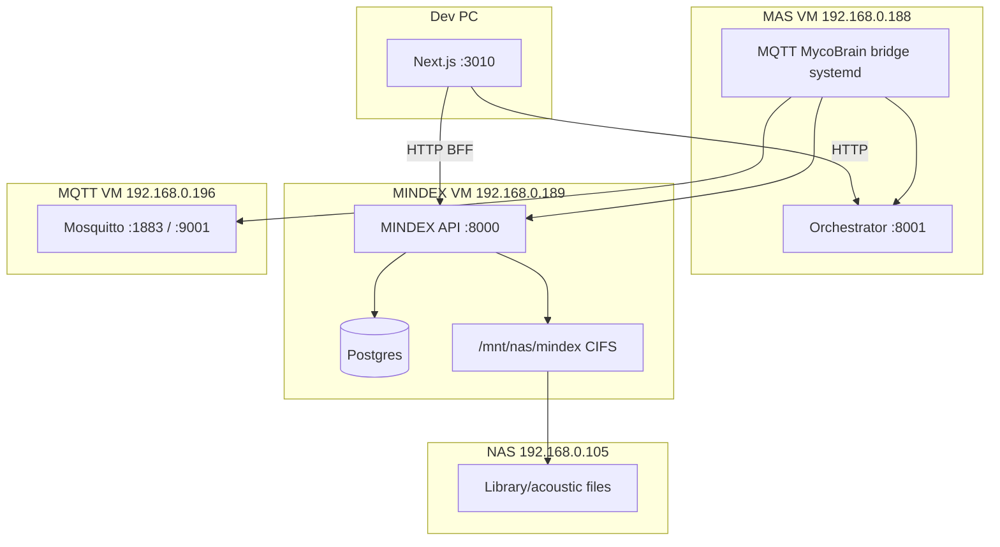

# SINE + MINDEX + NAS — Codex Frontend Test Handoff (May 27, 2026)

**Status:** MINDEX **189** Library backend **fixed** (disk prune + **2180** blobs); BFF **200** on **3010**. **Your job:** browser QA (Library tab should populate), fix remaining UI gaps, sandbox deploy after sign-off.

**Codex return (Library UX + backend):** `MINDEX_CODEX_RETURN_HANDOFF_MAY27_2026.md`

**Do not deploy sandbox** until this checklist passes on **3010**.

---

## Architecture (what talks to what)



| Path | Protocol | Required for |
|------|----------|----------------|
| Website → MINDEX **189:8000** | HTTP + `X-Internal-Token` | MINDEX console, **SINE**, library, ETL |
| Website → MAS **188:8001** | HTTP | Devices, mesh, unified network tabs |
| Field → Mosquitto **196:1883** | MQTT | Live device telemetry (optional for SINE) |
| MAS bridge **188** → MINDEX **189** | HTTP ingest | MQTT-sourced telemetry in DB |
| Acoustic files | **NAS CIFS** on 189 | SINE stream/analyze (not VM root disk) |

**SINE does not use MQTT.** MQTT only affects device/telemetry panels that show live hardware.

---

## Verified May 27 2026 (Cursor)

### MINDEX VM 189 — LIVE

| Check | Result |
|-------|--------|
| `GET /api/mindex/health` | **200** |
| `GET /api/mindex/library/storage` | **200** — `remote_nas: true`, `fstype: cifs`, ~7.4 TB free |
| `GET /api/mindex/sine/status` | **200** — 7 detectors, **2180** acoustic blobs |
| `GET /api/mindex/library/blobs?category=acoustic` | **200** |
| `GET /api/mindex/console` | **200** — ~10,166 taxa, ~823,972 observations |
| NAS mount | `//192.168.0.105/mycosoft.com/mindex` → `/mnt/nas/mindex` |
| `mindex-api` container | Up with `mindex_api` + `mindex_etl` + NAS volume mounts |

Recreate API if needed: `MINDEX/mindex/scripts/_recreate_api_with_etl_may27_2026.py`

### Website dev — BFF smoke (3010)

| URL | Status |
|-----|--------|
| `/api/mindex/sine/status` | **200** |
| `/api/mindex/library/storage` | **200** (`remote_nas: true` via BFF) |
| `/api/natureos/mindex/console` | **200** |
| `/sensing/sine/player` | **200** (page HTML) |
| `/natureos/mindex` | **200** |

### MAS VM 188

| Check | Result |
|-------|--------|
| Orchestrator container | **healthy** (`myca-orchestrator-new`) |
| `GET /health` | Returns **unhealthy** aggregate (local Postgres probe fails — DB is on **189**, not a blocker for HTTP APIs) |
| MQTT bridge systemd | **Deployed** (`mqtt-mycobrain-bridge.service`); broker login currently **`Not authorized`** to **196** — fix ACL/password via `MAS/scripts/mqtt_broker_auth_smoke_ssh.py` + `~/.config/mqtt-mycobrain-bridge.env` |

### MQTT

| Component | Host | Notes |
|-----------|------|--------|
| Broker | **192.168.0.196** | LAN `1883`, WS `9001`; public `wss://mqtt.mycosoft.com` |
| Bridge | **192.168.0.188** | `mqtt-mycobrain-bridge` → MAS heartbeats + MINDEX telemetry |
| Not on 189 | — | MINDEX ingests MQTT data via HTTP from bridge only |

Docs: `MAS/mycosoft-mas/docs/MQTT_MAS_MINDEX_BRIDGE_APR13_2026.md`, `MQTT_LAN_WSS_DEPLOYMENT_AND_JETSON_HANDOFF_APR08_2026.md`

---

## Ops still in progress (not blocking Codex UI test)

| Item | State | Impact |
|------|--------|--------|
| Library rsync to NAS | ~57G on NAS vs ~88G local backup; rsync running | VM root **~100% full** until backup removed |
| Local backup delete | After rsync ≥95% file count | Frees ~88 GB on 189; then `docker compose build api` safe |
| SINE analyze deps | `numpy`/`scipy`/`soundfile`/`auditok` optional in API image | `POST .../analyze` may 501 until `pip install -e '.[sine]'` in container |

---

## Codex environment (`WEBSITE/website/.env.local`)

```env
MINDEX_API_URL=http://192.168.0.189:8000
MINDEX_API_BASE_URL=http://192.168.0.189:8000
MINDEX_INTERNAL_TOKEN=<first token from VM /home/mycosoft/mindex/.env MINDEX_INTERNAL_TOKENS>
MAS_API_URL=http://192.168.0.188:8001
NEXT_PUBLIC_MAS_API_URL=http://192.168.0.188:8001
```

Restart dev server externally after env changes (`npm run dev:next-only`, port **3010** only).

**Never** put VM passwords or full token lists in git.

---

## Frontend test checklist (logged in — COMPANY / @mycosoft.org)

### A. MINDEX NatureOS app — `/natureos/mindex`

Full detail: `MINDEX_APP_CONSOLE_FRONTEND_HANDOFF_MAY27_2026.md`

- [ ] Overview: real taxa/obs counts, NAS card shows mounted (not zeros / demo)
- [ ] Data pipeline: 17 jobs; **Run** → toast + `POST /api/natureos/mindex/etl/run`
- [ ] Sync → `POST /api/natureos/mindex/sync`
- [ ] Explorer `/natureos/mindex/explorer` — taxa from BFF
- [ ] Storage tab — nodes + library; acoustic count grows over time
- [ ] Integrity / ledger tabs per `MINDEX_BACKEND_CURSOR_COMPLETE_MAY27_2026.md`
- [ ] Mobile 375px / 390px — no horizontal scroll

### B. SINE acoustic player — `/sensing/sine` and `/sensing/sine/player`

- [ ] Product page `/sensing/sine` loads, links to player
- [ ] Player lists blobs from `GET /api/mindex/sine/library/blobs` (or BFF equivalent)
- [ ] Stream plays for a blob (`.../library/blobs/{id}/stream` or sine stream route)
- [ ] Detector list from `GET /api/mindex/sine/detectors`
- [ ] **Analyze** button: `POST /api/mindex/sine/blobs/{id}/analyze` — expect real JSON or clear error if scipy missing (not mock layers)
- [ ] Visualisation layers load when analysis exists
- [ ] Empty state when API down (no fake waveforms / sample clips)

Backend doc: `MINDEX/mindex/docs/SINE_ACOUSTIC_BACKEND_MAY27_2026.md`

### C. Devices / MQTT-dependent UI (optional this sprint)

Only if testing live telemetry:

- [ ] Devices / network views show registry from MAS (not hardcoded list)
- [ ] After MQTT bridge running on 188 + publisher on 196, new telemetry appears in MINDEX-backed panels

---

## API smoke (PowerShell, from dev PC)

```powershell
$base = "http://192.168.0.189:8000/api/mindex"
$h = @{ "X-Internal-Token" = $env:MINDEX_INTERNAL_TOKEN }
Invoke-RestMethod "$base/health"
Invoke-RestMethod "$base/library/storage" -Headers $h
Invoke-RestMethod "$base/sine/status" -Headers $h
Invoke-RestMethod "$base/console" -Headers $h
Invoke-RestMethod "http://192.168.0.188:8001/health"
```

BFF (3010):

```powershell
Invoke-RestMethod http://localhost:3010/api/mindex/sine/status
Invoke-RestMethod http://localhost:3010/api/mindex/library/storage
Invoke-RestMethod http://localhost:3010/api/natureos/mindex/console
```

---

## Hard rules

- **No mock data** — empty/error states only (`no-mock-data` policy).
- **No iNaturalist fallback** in stats when MINDEX is up.
- **Do not** change hero/marketing pages unless Morgan asked.
- **Website deploy** (after pass): commit → push → SSH **187** → Docker rebuild **with NAS assets mount** → Cloudflare **Purge Everything**.

```bash
docker run -d --name mycosoft-website -p 3000:3000 \
  -v /opt/mycosoft/media/website/assets:/app/public/assets:ro \
  --restart unless-stopped mycosoft-always-on-mycosoft-website:latest
```

---

## Deploy sequence (after Codex sign-off)

| Step | Owner | Action |
|------|--------|--------|
| 1 | Codex | All checklists pass on **3010** |
| 2 | Morgan | Approve website commit |
| 3 | Agent/Codex | Push website → rebuild **187** → purge Cloudflare |
| 4 | Ops | Finish NAS rsync + delete VM backup on **189** |
| 5 | Ops | `docker compose up -d --build api` on 189 when disk free |
| 6 | Ops | `python MAS/scripts/deploy_mqtt_bridge_mas_vm.py` if live MQTT needed |

MINDEX backend deploy (if code changed): `MINDEX/mindex/_deploy_sine_acoustic_may27_2026.py` or git pull on 189.

---

## Related handoffs

| Doc | Scope |
|-----|--------|
| `MINDEX_BACKEND_CURSOR_COMPLETE_MAY27_2026.md` | MINDEX API + SINE backend verification |
| `MINDEX_APP_CONSOLE_FRONTEND_HANDOFF_MAY27_2026.md` | NatureOS MINDEX UI |
| `MINDEX/mindex/docs/SINE_ACOUSTIC_BACKEND_MAY27_2026.md` | SINE API reference |
| `MINDEX/mindex/docs/MINDEX_LIBRARY_NAS_MOUNT_MAY27_2026.md` | NAS mount policy |
| `MINDEX/mindex/docs/STACK_VERIFY_MAY27_2026.json` | Machine-readable stack snapshot |
| `MAS/mycosoft-mas/docs/MQTT_MAS_MINDEX_BRIDGE_APR13_2026.md` | MQTT bridge |

---

## Approval criteria

- All **Section A + B** checkboxes pass in browser on **3010** against live **189** / **188**
- No `source: "demo"` on genomes/compounds/stats
- SINE player uses real blob list and stream URLs from MINDEX
- Morgan signs off → sandbox deploy per `deployment-checklist.mdc`
