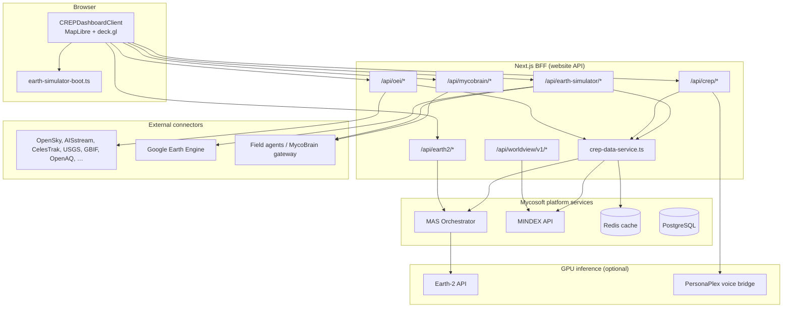

# Earth Simulator

**The fungal-first planetary intelligence map.**


**Live:** [mycosoft.com/natureos/earth-simulator](https://mycosoft.com/natureos/earth-simulator)  
**Last updated:** June 13, 2026

---

## What is Earth Simulator?

**Earth Simulator** is Mycosoft’s public-facing name for the **CREP** — the *Common Relevant Environmental Picture*: a full-screen, intelligence-grade map of the planet that puts **fungi, biodiversity, and field biology** at the center, then layers in everything else an operator, scientist, or citizen needs to understand what is happening on Earth *right now*.

Open the map and you get a living globe (or flat map on mobile) with satellite imagery, submarine cables, power plants, earthquakes, wildfires, live aircraft and ships, satellites in orbit, air quality, civic facilities, regional science projects, and **MycoBrain field sensors** streaming real environmental telemetry — all toggleable from one layer panel. Pan anywhere; the **viewport intelligence** panel summarizes conditions, sensors, and context for what you are looking at. Ask **MYCA** for an AI brief of the visible area.

This is not a static GIS demo. Earth Simulator is wired to **40+ live data connectors**, the **MINDEX** mycological database, the **MAS** multi-agent system, optional **NVIDIA Earth-2** weather and spore models, and deployed **Mushroom 1**, **Hyphae 1**, and **Psathyrella** buoy hardware in the field. Every production path uses **real API data** — empty states when a feed is down, never fabricated placeholders.

> **Why fungal-first?** Mycosoft’s mission is to make fungal intelligence visible at planetary scale. Earth Simulator opens with the **Ectomycorrhizal (EcM) fungal atlas**, live iNaturalist and MINDEX nature observations, and mycelium probability layers — because understanding the hidden mycelial layer is how we understand ecosystems, carbon, water, and resilience.

---

## What you can explore

### The living map

- **Satellite basemap** with bathymetry and topography — zoom from continental view to street-scale detail
- **Globe or map mode** — desktop globe projection; mobile-optimized flat map with full layer access
- **Staged boot** — the map paints in seconds with the layers that matter first; heavy live feeds stream in without blocking first paint
- **Works on your phone** — full Earth Simulator on iOS and Android via the CREP mobile shell (layer drawers, intel panels, touch controls)

### Nature, species & fungal intelligence

- **Fungal Atlas (EcM)** — default raster overlay of ectomycorrhizal fungal distribution
- **Live observations** — fungi, plants, birds, and marine life from iNaturalist, GBIF, eBird, OBIS, and MINDEX
- **Mycelium probability** — modeled likelihood grids and heat tiles
- **Species search** — find taxa and jump to observations on the map

### Hazards & natural events

- **Earthquakes, volcanoes, wildfires, storms, lightning, tornadoes, floods** — global event layers with viewport-aware loading
- **Space weather** — solar activity, aurora forecasts, sun–earth correlation (opt-in)
- **NWS alerts** and **USGS** feeds for authoritative hazard data

### Sky, sea & orbit

- **Live aviation** — aircraft positions from OpenSky and FlightRadar24
- **Maritime** — vessels via AIS; fishing activity; global ports
- **Satellites & debris** — multi-source orbital catalog (CelesTrak, Space-Track, amateur TLE networks)
- **Orbit paths** — deck.gl-rendered tracks for selected space objects

### Infrastructure & energy

- **Submarine cables** and **transmission lines** — the backbone of the internet and grid
- **Power plants**, substations, pipelines, factories, ports, airports
- **Cell towers**, data centers, radio stations — telecom and compute footprint
- **Railways** — network geometry plus live train positions where available

### Air, water & environment

- **Air quality** — OpenAQ and AirNow live AQI
- **NOAA buoys** — coastal and offshore sensor stations
- **Carbon Mapper** plumes and pollution overlays (where configured)
- **Border wait times**, **H₂S monitoring** (San Diego region), **Tijuana estuary** project layers

### Field science & MycoBrain devices

Earth Simulator is the **operator console for deployed Mycosoft hardware**:

| Device | What it does on the map |
|--------|-------------------------|
| **Mushroom 1** | Jetson field node — San Diego lab; BME688 VOC / environmental telemetry |
| **Hyphae 1** | Jetson field node — Southwestern College, Chula Vista; live sensor stream |
| **Psathyrella buoy** | Aquatic MycoBrain buoy — Project Oyster reef; water-adjacent gas and env sensing |

Click a device marker for live readings, status, and operator controls when a field gateway is connected. Device data merges from the MAS registry, field agents, and the MycoBrain gateway — **no mock devices**.

### Regional science projects

Purpose-built layers for active Mycosoft field work:

- **Project Oyster** — plume and emit visualization on the San Diego coast
- **San Diego / Tijuana corridor** — estuary, border, and cross-border environmental context
- **Mojave** and other project-scoped overlays — enabled when you zoom into the region

### MYCA & viewport intelligence

- **Viewport environment** — weather, air, and context for the bounds you are viewing
- **Viewport sensors** — rollup of buoys, stations, and devices in view
- **Viewport intel** — fused operational picture for the visible map
- **AI summary** — MYCA-generated brief of what matters in your current viewport

### Earth-2 weather & spore models (optional)

When the Earth-2 GPU stack is enabled, layers for **forecast**, **nowcast**, **wind**, **temperature**, **precipitation**, and **spore dispersal** can be toggled on — powered by MAS orchestration and NVIDIA Earth-2 inference.

### Eagle Eye & live cameras

Public **CCTV**, **YouTube live**, and **Eagle Eye** camera feeds can be placed on the map for ground-truth visual confirmation of events and sites.

---

## Who it is for

| Audience | How they use Earth Simulator |
|----------|------------------------------|
| **Scientists & mycologists** | Fungal atlas, species observations, mycelium models, field device telemetry |
| **Conservation & ecology** | Biodiversity hotspots, habitat layers, iNaturalist/MINDEX nature stream |
| **Environmental operators** | Hazards, air quality, buoys, regional project monitors (H₂S, estuary, oyster) |
| **Infrastructure & telecom** | Cables, grid, data centers, cell coverage, ports and transport |
| **Defense & situational awareness** | CREP entry at `/defense/crep`; live movers, civic facilities, fused viewport intel |
| **Educators & the public** | Free exploration of a real, live planetary map — fungi first, everything else on demand |

---

## Try it

| Entry | URL |
|-------|-----|
| **Canonical (NatureOS)** | [mycosoft.com/natureos/earth-simulator](https://mycosoft.com/natureos/earth-simulator) |
| **Dashboard** | [mycosoft.com/dashboard/crep](https://mycosoft.com/dashboard/crep) |
| **Defense CREP** | [mycosoft.com/defense/crep](https://mycosoft.com/defense/crep) |
| **Sandbox** | [sandbox.mycosoft.com/natureos/earth-simulator](https://sandbox.mycosoft.com/natureos/earth-simulator) |

Legacy `/apps/earth-simulator` redirects to the canonical URL. The old Cesium 3D globe (January 2026) is **deprecated**; production Earth Simulator is the MapLibre + deck.gl CREP stack (May 2026+).

---

## Documentation

| Document | Audience | Description |
|----------|----------|-------------|
| **[Technical Outline](../EARTH_SIMULATOR_TECHNICAL_REFERENCE.md)** | Engineers, QA, integrators | **Definitive capability index** — layer registry, API catalog, boot sequence, and architecture (internal deployment details are maintained separately; not for public redistribution) |
| **[Documentation Index](../EARTH_SIMULATOR_DOCS_INDEX.md)** | Everyone | Master index of Earth Simulator / CREP docs, handoffs, and deprecated Cesium-era files |
| **This README** | Public + developers | Product overview (above) and developer reference (below) |

**Historical reference (Cesium era, January 2026):** `ARCHITECTURE.md`, `API.md`, `GRID_SYSTEM.md`, `DEPLOYMENT.md`, `PERFORMANCE.md`, `UIUX.md` in this folder — superseded by the Technical Outline and this README; retained for archive.

**Recent handoffs (May–June 2026):** see the [Documentation Index](../EARTH_SIMULATOR_DOCS_INDEX.md#crep--recent-handoffs-mayjune-2026) for device backend, first-paint, production map, and field-device audit reports.

---

## For developers

The sections below describe the **public integration surface** — routes, APIs, and architecture at a high level. **Internal hostnames, private network addresses, VM layout, and deployment runbooks are not published here.** Mycosoft operators should use internal documentation for environment configuration and production operations.

For exhaustive feature coverage (layer IDs, boot gates, file references), see the in-repo **[Technical Outline](../EARTH_SIMULATOR_TECHNICAL_REFERENCE.md)** (maintained for engineering; sanitize before any external release).

### Overview & mission

The **Earth Simulator** is Mycosoft's production **CREP** implementation — a fungal-first, real-time planetary intelligence map backed by MapLibre GL, deck.gl, PMTiles, and a Next.js BFF. It unifies environmental feeds, infrastructure, biodiversity, field MycoBrain sensors, orbital objects, and optional Earth-2 model layers.

**Engineering goals:**

- Visualize **fungal intelligence** (EcM atlas, iNaturalist/MINDEX nature stream, mycelium probability) as the default first-paint focus
- Integrate **live movers** (aviation, maritime, satellites) and **natural events** when enabled
- Surface **field MycoBrain devices** with real BME688 telemetry — no mock or placeholder data
- Power **viewport intelligence** (environment, sensors, AI summary) for visible map bounds
- Connect to **MAS**, **MINDEX**, **OEI connectors**, and optional **Earth-2** inference through the Next.js backend-for-frontend (BFF)

**Repository:** `WEBSITE/website` (Next.js 15 App Router)

---

## Capabilities & features

### Globe & map

| Feature | Description |
|--------|-------------|
| **MapLibre GL** basemap | Satellite imagery, bathymetry, topography; ESRI/GIBS/Mapbox tile proxies via CREP BFF |
| **Staged boot profile** | `lib/crep/earth-simulator-boot.ts` — layers ON/OFF at refresh for fast first paint |
| **deck.gl EntityDeckLayer** | Aircraft, vessels, satellites with orbit paths (single orbit source) |
| **LOD policy** | Zoom-aware DOM caps, infra deferral, fungal marker thresholds |
| **Mobile shell** | `CrepMobileShell` — full map on phone with bottom-sheet layer/intel drawers |
| **24×24 land grid** | Viewport-based land tile IDs via `/api/earth-simulator/land-tiles` and grid APIs |
| **Photo3D** | `/dashboard/crep/photo3d` — photorealistic 3D tiles (opt-in layer) |

### Layers (boot profile summary)

**ON at refresh** (`EARTH_SIM_PROFILE_ON_LAYER_IDS`):

- Base: `satImagery`, `bathymetry`, `topography`, `fungalAtlasECM`
- Infra lines: submarine cables, global transmission lines; deferred infra points (power plants, cell towers, ports, factories, pipelines, etc.)
- Events: earthquakes, volcanoes, wildfires, storms, lightning, tornadoes, floods
- Devices: MycoBrain boot layers, fungi/biodiversity, buoys, live AQI, live transit, railway trains
- Boundaries: country, state, county jurisdictions
- Civic: hospitals, fire stations, universities, police, libraries
- Telecom: IM3 data centers, signal heatmap

**OFF at refresh** (user enables via layer panel):

- Movers: aviation, ships, satellites, fishing, containers
- Earth-2: forecast, nowcast, spore dispersal, wind/temp/precip overlays
- Space weather: solar, aurora, sun–earth impact
- Military movers, factories (duplicate toggles), weather population layers, project-scoped regional layers

Set `NEXT_PUBLIC_EARTH_SIM_STAGED_BOOT=0` to revert to legacy mount behavior.

### Fungal intelligence

- **Fungal Atlas EcM** raster (default; AM layer mutually exclusive at boot)
- **CREP fungal API** — observations, atlas samples, deployment metadata, vector tiles
- **iNaturalist** proxy with MINDEX-backed nature stream and preloaded bbox cache
- **Mycelium probability** grid and tile endpoints
- Fungi-only ground filter at first paint (other kingdoms opt-in)

### OEI feeds (Orbital Earth Intelligence)

Live and static connectors under `/api/oei/*`: OpenSky/FlightRadar24 aviation, AISstream maritime, multi-source satellite registry (CelesTrak, Space-Track, N2YO, MINDEX), USGS/EONET events, GBIF/eBird/OBIS biodiversity, OpenAQ air quality, infrastructure (power grid, submarine cables, cell towers, railways), space weather, military bases, factories, and more. All routes return **real API data** or explicit empty/error states — never fabricated records.

### Earth-2 integration

Optional GPU-backed weather and spore layers via `/api/earth2/*`, proxied through MAS to the Earth-2 inference service. Layers start **disabled** at boot.

### Field devices & MycoBrain

| Device | Role |
|--------|------|
| **Mushroom 1** | Field Jetson node — San Diego lab; BME688 VOC / environmental telemetry |
| **Hyphae 1** | Field Jetson node — Southwestern College, Chula Vista; live sensor stream |
| **Psathyrella buoy** | Aquatic MycoBrain buoy — Project Oyster reef; water-adjacent gas and env sensing |

`GET /api/earth-simulator/devices` merges device catalog entries, known field deployments, the MAS device registry, operator agent probes, and MycoBrain gateway telemetry into a single map layer.

Operator commands (buzzer/beep, LEDs) route through the device command API when a gateway is reachable.

### Viewport intelligence

- `GET /api/crep/viewport-environment` — environmental context for bounds
- `GET /api/crep/viewport-sensors` — sensor rollup
- `GET /api/crep/viewport-intel` — fused intel picture
- `POST /api/crep/viewport-ai-summary` — MYCA/LLM summary for viewport
- `GET /api/crep/infra/viewport-stats` — infrastructure counts in view

### Projects & regional layers

Project-scoped layers (San Diego/Tijuana corridor, Mojave, Oyster plume, SDAPCD H₂S, Tijuana estuary, border wait times) load via `/api/crep/*` regional routes. Generic project layer IDs are detected by prefix in `earth-simulator-boot.ts`.

---

## Architecture



**Main implementation files:**

| Layer | Path |
|-------|------|
| Page (canonical) | `app/natureos/earth-simulator/page.tsx` |
| Dashboard client | `app/dashboard/crep/CREPDashboardClient.tsx` |
| Lazy loader | `app/dashboard/crep/CREPDashboardLoader.tsx` |
| Boot profile | `lib/crep/earth-simulator-boot.ts` |
| Data service | `lib/crep/crep-data-service.ts` |
| Field devices | `lib/devices/field-deployments.ts` |
| Entity rendering | `components/crep/layers/deck-entity-layer.tsx` |
| Map controls | `components/crep/map-controls.tsx` |
| API URL config | `lib/config/api-urls.ts` |

---

## Routes index (pages)

| Route | Role |
|-------|------|
| **`/natureos/earth-simulator`** | **Canonical** Earth Simulator (CREP MapLibre) |
| `/dashboard/crep` | Same dashboard (dashboard entry) |
| `/natureos/crep` | Same dashboard (NatureOS alias) |
| `/defense/crep` | Same dashboard (defense entry) |
| `/earth-simulator` | **301 redirect** → `/natureos/earth-simulator` (`next.config.js`) |
| `/natureos/tools/earth-simulator` | **301 redirect** → canonical |
| `/apps/earth-simulator` | **Server redirect** → canonical (Cesium deprecated May 2026) |
| `/dashboard/crep/photo3d` | Photorealistic 3D CREP view |
| `/defense` | Defense hub |
| `/defense/oei` | OEI monitoring dashboard |
| `/defense/fusarium` | FUSARIUM biosecurity view |
| `/docs/apps/earth-simulator` | In-app documentation page |

---

## API catalog

All routes live under the website Next.js `app/api/` tree. Methods below reflect `route.ts` exports in the production codebase (June 2026).

### `/api/earth-simulator/*` (15 routes)

| Endpoint | Methods | Purpose |
|----------|---------|---------|
| `/aggregate` | POST | Viewport data aggregation, mycelium probability |
| `/cell/[cellId]` | GET | Grid cell detail |
| `/devices` | GET | Merged MycoBrain / MAS / field device markers |
| `/gee` | GET, POST | Google Earth Engine proxy (status, datasets, stats) |
| `/gee/tile/[type]/[z]/[x]/[y]` | GET | GEE tile proxy |
| `/grid` | GET, POST | Land grid utilities |
| `/heat-tiles/[z]/[x]/[y]` | GET | Thermal heat map tiles |
| `/inaturalist` | GET, POST | iNaturalist observation proxy |
| `/land-tiles` | GET | 24×24 land grid tile manifest |
| `/layers` | GET | Layer metadata |
| `/mycelium-probability` | GET, POST | Mycelium probability model |
| `/mycelium-tiles/[z]/[x]/[y]` | GET | Mycelium raster tiles |
| `/search` | GET | Geospatial search |
| `/tiles/[z]/[x]/[y]` | GET | Generic Earth Simulator tiles |
| `/weather-tiles/[z]/[x]/[y]` | GET | Weather raster tiles |

### `/api/crep/*` (38 routes)

| Endpoint | Methods | Purpose |
|----------|---------|---------|
| `/unified` | GET | Cached multi-domain CREP bundle (aircraft, vessels, satellites, fungal, devices, events) |
| `/health` | GET | CREP BFF health |
| `/status` | GET | Service status |
| `/services` | GET | Connector registry |
| `/fungal` | GET | Fungal observations GeoJSON |
| `/fungal-atlas` | GET | Atlas metadata |
| `/fungal-atlas/deployment` | GET | Atlas deployment info |
| `/fungal-atlas/samples` | GET | Atlas sample points |
| `/fungal-atlas/tiles/[layer]/[z]/[x]/[y]` | GET | Atlas raster tiles |
| `/nature/preloaded` | GET | Preloaded nature bbox cache |
| `/nature-stream` | GET | SSE/streaming nature observations |
| `/species/search` | GET | Species search |
| `/mycosoft-devices` | GET | CREP device list |
| `/viewport-environment` | GET | Viewport environmental summary |
| `/viewport-sensors` | GET | Viewport sensor rollup |
| `/viewport-intel` | GET | Viewport fused intel |
| `/viewport-ai-summary` | POST | AI-generated viewport brief |
| `/infra/viewport-stats` | GET | Infrastructure stats in bounds |
| `/geocode` | GET | Forward geocode |
| `/reverse-geocode` | GET | Reverse geocode |
| `/preferences` | GET, POST | User CREP preferences |
| `/waypoints` | GET, POST | Saved waypoints |
| `/waypoints/[id]` | PATCH, DELETE | Single waypoint update/delete |
| `/tiles/[...tile]` | GET | CREP tile catch-all |
| `/tiles/satellite/[basemap]/[z]/[x]/[y]` | GET | Satellite basemap proxy (ESRI/Mapbox/GIBS) |
| `/tile-render/[layer]/[z]/[x]/[y]` | GET | Dynamic layer tile render |
| `/airnow/bbox` | GET | AirNow AQI by bbox |
| `/airnow/current` | GET | Current AQI |
| `/biodiversity-hotspots` | GET | Hotspot layer |
| `/border-wait-times` | GET | US–Mexico border wait times |
| `/buoy/[station]` | GET | NOAA buoy detail |
| `/mojave` | GET | Mojave project layer |
| `/oyster/emit` | GET | Project Oyster emit layer |
| `/oyster/plume` | GET | Oyster plume model |
| `/sdapcd/h2s` | GET | SDAPCD H₂S monitoring |
| `/sdapcd/h2s/chart` | GET | H₂S chart data |
| `/sdapcd/h2s/collect` | GET, POST | H₂S data collection |
| `/tijuana-estuary` | GET | Tijuana estuary project |

### `/api/oei/*` (37 routes)

| Endpoint | Methods | Purpose |
|----------|---------|---------|
| `/opensky` | GET | OpenSky aviation |
| `/flightradar24` | GET | FlightRadar24 (keyed) |
| `/flight-history/[id]` | GET | Flight track history |
| `/aisstream` | GET | AIS maritime (keyed WebSocket cache) |
| `/satellites` | GET | Multi-source satellite registry |
| `/orbital-objects` | GET | Orbital catalog |
| `/debris` | GET | Orbital debris |
| `/space-weather` | GET | SWPC space weather |
| `/space-weather/aurora` | GET | Aurora forecast |
| `/sun-earth-correlation` | GET | Sun–Earth correlation |
| `/events` | GET | Global events |
| `/eonet` | GET | NASA EONET |
| `/nws-alerts` | GET | NWS alerts |
| `/usgs-volcano` | GET | USGS volcanoes |
| `/gbif` | GET | GBIF occurrences |
| `/ebird` | GET | eBird observations |
| `/obis` | GET | OBIS marine life |
| `/openaq` | GET | OpenAQ air quality |
| `/buoys` | GET | NOAA buoys |
| `/fishing` | GET | Fishing vessel activity |
| `/ports` | GET | Global ports |
| `/railways` | GET | Railway network |
| `/railway-live` | GET | Live train positions |
| `/power-grid` | GET | Power grid features |
| `/power-plants` | GET | Power plant locations |
| `/transmission-lines-global` | GET | Transmission lines |
| `/submarine-cables` | GET | Submarine cables |
| `/cell-towers-global` | GET | Cell towers |
| `/radio-stations` | GET | Radio stations |
| `/radar` | GET | Weather radar |
| `/cctv` | GET | Public CCTV feeds |
| `/youtube-live` | GET | YouTube live cameras |
| `/carbon-mapper` | GET | Carbon Mapper plumes |
| `/factories` | GET | Factory/industrial sites |
| `/military` | GET | Military installations |
| `/drone-no-fly` | GET | Drone no-fly zones |
| `/overpass` | GET | OpenStreetMap Overpass proxy |
| `/sdr/listen` | GET | SDR listen metadata |

### `/api/earth2/*` (12 routes)

| Endpoint | Methods | Purpose |
|----------|---------|---------|
| `(root)` | GET | Earth-2 status via MAS proxy |
| `/health` | GET | Service health |
| `/forecast` | GET, POST | Atlas forecast runs |
| `/nowcast` | GET | Nowcast |
| `/nowcast/storms` | GET | Storm nowcast |
| `/alerts` | GET | Weather alerts |
| `/models` | GET | Available models |
| `/layers` | GET | Layer catalog |
| `/layers/grid` | GET | Grid layer metadata |
| `/layers/wind` | GET | Wind layer |
| `/spore-dispersal` | GET, POST | Spore dispersal model |
| `/tiles/[variable]/[z]/[x]/[y]` | GET | Earth-2 raster tiles |

### Related APIs

| Prefix | Purpose |
|--------|---------|
| `/api/mycobrain/*` | Serial gateway, telemetry, buzzer/beep, device control |
| `/api/worldview/v1/*` | MINDEX Worldview public search/API keys |
| `/api/stream/crep` | CREP real-time stream |
| `/api/search/crep` | CREP search integration |

---

## Data sources & external connectors

**Policy:** No mock, fake, or placeholder data in production paths. If an upstream API is unavailable or rate-limited, the UI shows empty states, cached stale data, or explicit error messages.

| Domain | Sources |
|--------|---------|
| **Aviation** | OpenSky Network, FlightRadar24 (API key) |
| **Maritime** | AISstream (API key), fishing registries |
| **Satellites** | CelesTrak, Space-Track, N2YO (optional key), UCS enrichment, MINDEX ingest |
| **Biodiversity** | iNaturalist, GBIF, eBird, OBIS, MINDEX nature stream |
| **Weather & hazards** | NWS, USGS, NASA EONET, SWPC space weather |
| **Air quality** | OpenAQ, AirNow |
| **Infrastructure** | OpenStreetMap Overpass, power grid datasets, submarine cable registry, EIA power plants |
| **Basemap** | ESRI World Imagery, NASA GIBS, Mapbox (token), Google Earth Engine (when configured) |
| **Fungal** | MINDEX fungal atlas, CREP fungal layers, mycelium probability model |
| **Devices** | MAS device registry, field agent APIs, MycoBrain gateway |
| **Earth-2** | MAS Earth-2 orchestration → GPU inference service |

Data is cached server-side (`crep-data-service.ts`, Redis when `REDIS_URL` is set) with stale-while-revalidate patterns to protect upstream rate limits.

---

## Field devices & controls

### Boot-on MycoBrain layers

At refresh, Earth Simulator enables a fixed set of device-related layers (MycoBrain field nodes, SporeBase, Psathyrella, partners, and related markers). Layer IDs are defined in `lib/crep/earth-simulator-boot.ts`.

### Device API merge order

`GET /api/earth-simulator/devices` combines:

1. Known product catalog entries  
2. Registered field deployments  
3. MAS device registry heartbeats  
4. Operator agent health probes (when configured)  
5. MycoBrain gateway telemetry (when configured)

### Operator controls

Device actuators (buzzer, LEDs, and related MDP commands) are exposed through the MycoBrain control API when a gateway is online. See `lib/devices/operator-commands.ts` in the website repo.

---

## Configuration (high level)

Earth Simulator reads backend URLs and connector credentials from environment variables at build/runtime. **Do not commit secrets or private network addresses to git.**

| Category | Examples (names only) |
|----------|------------------------|
| **Platform APIs** | `MAS_API_URL`, `MINDEX_API_URL`, `NEXT_PUBLIC_MAS_API_URL` |
| **Devices** | `MYCOBRAIN_SERVICE_URL` |
| **Earth-2** | `EARTH2_API_URL` |
| **Caching** | `REDIS_URL` |
| **Basemap** | `NEXT_PUBLIC_MAPBOX_ACCESS_TOKEN` |
| **Boot behavior** | `NEXT_PUBLIC_EARTH_SIM_STAGED_BOOT` |
| **Live feeds (optional)** | `AISSTREAM_API_KEY`, `FLIGHTRADAR24_API_KEY`, `N2YO_API_KEY`, `SPACETRACK_USER`, `SPACETRACK_PASS` |

Mycosoft operators: use the internal environment template and deployment docs — not this public README — for hostnames, ports, and production values.

---

## Local development

```bash
npm install
npm run dev:next-only   # full site + Earth Simulator
# or
npm run dev:crep        # CREP-focused dev server
```

Open **http://localhost:3010/natureos/earth-simulator** (default dev port). Point `MAS_API_URL` and `MINDEX_API_URL` at your configured Mycosoft platform endpoints to load live data.

---

## Deployment

Production Earth Simulator ships with the **mycosoft.com** website container. Releases follow Mycosoft’s standard commit → build → deploy → CDN cache purge pipeline. **Internal VM addresses, SSH steps, and container run commands are not documented in this public README.**

Verify after release: [mycosoft.com/natureos/earth-simulator](https://mycosoft.com/natureos/earth-simulator)

---

## Key source files

```
app/
├── natureos/earth-simulator/page.tsx      # Canonical page
├── dashboard/crep/
│   ├── page.tsx
│   ├── CREPDashboardClient.tsx            # Main MapLibre + deck.gl client
│   ├── CREPDashboardLoader.tsx            # Dynamic import, mobile shell
│   └── photo3d/page.tsx
├── defense/crep/page.tsx                  # Re-exports loader
├── apps/earth-simulator/page.tsx          # Redirect → canonical
└── api/
    ├── earth-simulator/**/route.ts
    ├── crep/**/route.ts
    ├── oei/**/route.ts
    └── earth2/**/route.ts

lib/
├── crep/
│   ├── earth-simulator-boot.ts            # Staged boot ON/OFF layers
│   ├── crep-data-service.ts               # Unified fetch + cache
│   ├── data-cache.ts
│   └── registries/satellite-registry.ts
├── devices/
│   ├── field-deployments.ts               # Mushroom1, Hyphae1, Psathyrella
│   └── operator-commands.ts               # Buzzer/beep, actuator commands
├── config/api-urls.ts                     # Platform API URL configuration
└── google-earth-engine.ts                 # GEE proxy helpers

components/crep/
├── layers/deck-entity-layer.tsx
├── map-controls.tsx
├── crep-resource-hints.tsx
└── mobile/crep-mobile-shell.tsx
```

---

## Related documentation

| Document | Notes |
|----------|-------|
| **[`docs/EARTH_SIMULATOR_TECHNICAL_REFERENCE.md`](../EARTH_SIMULATOR_TECHNICAL_REFERENCE.md)** | **Technical Outline** — engineering capability index (internal; may contain ops detail — review before external release) |
| [`docs/EARTH_SIMULATOR_DOCS_INDEX.md`](../EARTH_SIMULATOR_DOCS_INDEX.md) | Master index (updated June 2026) |
| `docs/crep plan.md` | CREP roadmap |
| `docs/CREP_INFRASTRUCTURE_DEPLOYMENT.md` | Infra deployment |
| `docs/CREP_API_CACHING_FEB18_2026.md` | Caching strategy |
| `docs/codex-handoffs/EARTH_SIMULATOR_*_JUN*.md` | Recent implementation handoffs |
| `docs/reports/earth-field-mycobrain-devices-2026-05-27.md` | Field device audit |
| MAS `docs/CREP_*` | Collector and voice-control docs |

**In-repo legacy (Cesium era — reference only):**

- `docs/earth-simulator/ARCHITECTURE.md`, `API.md`, `GRID_SYSTEM.md` — January 2026 Cesium docs; superseded by this README

---

## Legacy appendix: Cesium Earth Simulator (deprecated)

| Item | Status |
|------|--------|
| Route `/apps/earth-simulator` | Redirects to `/natureos/earth-simulator` (May 21, 2026) |
| `components/earth-simulator/cesium-globe.tsx` | Unreachable from public routes; candidate for removal |
| CesiumJS 3D globe | Replaced by **MapLibre GL + deck.gl** CREP stack |
| Google Earth Engine | Still supported via `/api/earth-simulator/gee/*` as tile/stats proxy |
| Port `3002` / NatureOS tab embed | Obsolete — use `/natureos/earth-simulator` |

Do not build new features on the Cesium components. All new Earth Simulator work belongs in `app/dashboard/crep/` and `lib/crep/`.

---

## License & attribution

Part of the [Mycosoft](https://mycosoft.com) NatureOS platform. External data sources retain their respective licenses and rate-limit terms; see connector implementations under `lib/oei/` and `app/api/oei/`.
