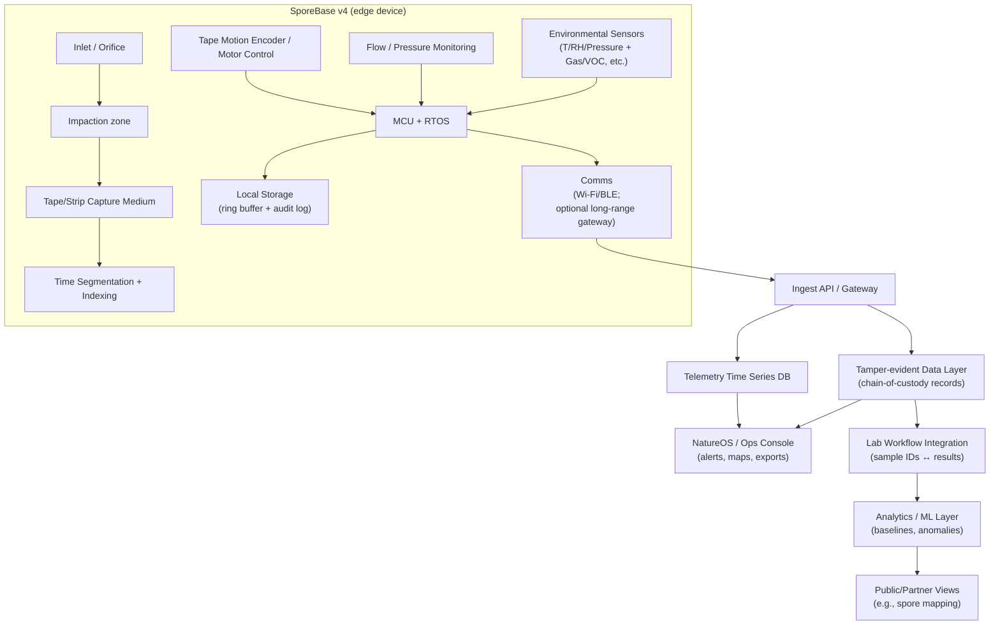
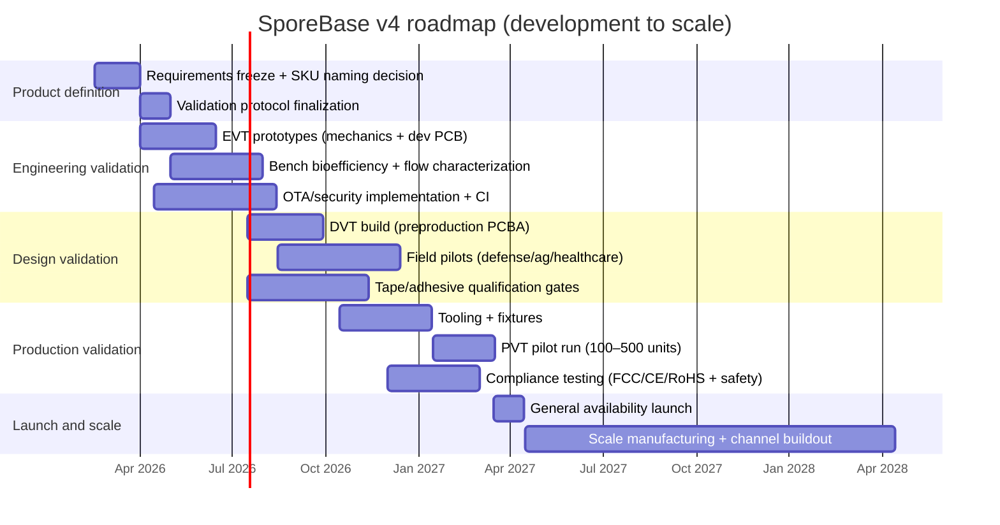

# SporeBase v4 White Paper and Product Plan

## Executive summary

SporeBase v4 is positioned on entity["company","Mycosoft","fungal intelligence platform"]’s website as a **bioaerosol collection system**—a field‐deployable device intended to capture airborne biological material in time-indexed segments for downstream laboratory analysis and networked environmental intelligence. On the public Devices catalog, SporeBase is labeled “Bioaerosol Collection System” and shown as “In Stock.” citeturn33view0 On the Defense capabilities page, SporeBase is described more specifically as **“Time-indexed bioaerosol collection for atmospheric biological sampling with lab integration”** with **15–60 minute segments**, **PCR-ready sampling**, **solar power**, and **~100 m coverage** (implying Wi‑Fi-class range). citeturn32view0

A key near-term issue is **product-definition clarity**. Another page on the same site describes “SporeBase” as a **professional-grade incubation platform** with IoT sensing for temperature, humidity, CO₂, and growth monitoring—functionally a different product category. citeturn34view2 This white paper therefore treats **SporeBase v4 as the bioaerosol collector** (consistent with the Devices catalog, the Defense capability description, and the internal technical proposal describing a tape-based aerosol particle collector). citeturn33view0turn32view0 fileciteturn0file1 A recommended commercialization step is to resolve the naming collision as either (a) two SKUs (“SporeBase Air” vs “SporeBase Incubator”) or (b) a single platform with clearly separated configurations and claims.

Scientifically, SporeBase v4 addresses a well-established gap in bioaerosol work: **continuous sampling with defensible time indexing**, plus compatibility with modern molecular methods (qPCR, sequencing). Reviews emphasize that sampling devices introduce bias (cut-off size, flow rate, collection medium, bioefficiency), and good practice requires **laboratory determination of bioefficiency** for the chosen sampler and targets before field deployment. citeturn18view2turn35view0 SporeBase’s value proposition is strongest when it couples (1) **chain-of-custody & tamper-evident data** (aligned to Mycosoft’s “MINDEX” positioning) with (2) **repeatable sampling & calibration** and (3) **a public-facing network effect** visible already in the Spore Tracker application. citeturn32view0turn31view0

Commercially, the go-to-market should lead with **high-need segments** where continuous bioaerosol context reduces real costs: installation environmental intelligence (defense/critical infrastructure), hospital construction/renovation monitoring, agriculture plant pathogen surveillance, and industrial IAQ/microbial risk. The Defense portal explicitly positions “Operational Environmental Intelligence” as a new discipline for the entity["organization","U.S. Department of Defense","us military department"], emphasizing persistent biological sensing, real-time awareness, and mission-critical infrastructure protection. citeturn11view2turn12view1 A practical commercialization plan is to run **paid pilots** first (data credibility + reference deployments), then scale manufacturing and subscriptions.

Financially, a plausible plan is a **hardware + recurring revenue** model: base device sale plus (a) consumables (tape/cartridges, calibration) and (b) SaaS (telemetry, alerting, mapping, audit exports). Three-year modeled scenarios are included later, with explicit assumptions.

## Abstract

SporeBase v4 is a time-indexed bioaerosol sampling system designed to collect airborne biological particles onto a capture medium (tape/strip) in discrete, timestamped segments (15–60 minutes) for downstream analysis (e.g., PCR) and for integration into a larger environmental intelligence platform. citeturn32view0 Its scientific purpose is to enable longitudinal, geographically distributed sampling that supports biodiversity monitoring, public health and biosurveillance workflows, and correlation of atmospheric biological signals with meteorology and built-environment operations. Peer-reviewed literature identifies inertia-based collection (impaction) as a standard approach and emphasizes the need for sampler-specific bioefficiency characterization, flow calibration, and protocol standardization to avoid biased inference. citeturn35view0turn18view2turn36view0

This white paper provides a rigorous engineering and commercialization plan for SporeBase v4: product definition and capabilities from Mycosoft’s public materials, firmware architecture and secure update strategy, a hardware/BOM plan with candidate suppliers and a scale-up pathway, biosafety/regulatory considerations for electronics and biosample transport, a validation program (bench + field) with metrics and sample protocols, and a go-to-market strategy including pricing models, partnerships, pilots, and a three-year cost/revenue projection with conservative/likely/optimistic scenarios. citeturn33view0turn32view0turn31view0turn18view2turn15search4turn15search2 fileciteturn0file0turn0file1

## Product definition and capabilities

SporeBase v4 should be defined in requirements language as:

**A solar-capable, field-deployable, time-indexed bioaerosol sampler that (1) pulls a controlled airflow through an inlet/orifice, (2) impacts particles onto a removable capture medium in 15–60 minute segments, (3) stores/streams metadata and QA signals, and (4) integrates with lab workflows (“PCR-ready”) and platform workflows (alerts, mapping, chain-of-custody).** citeturn32view0turn33view0

**Public-facing capabilities already implied by the website ecosystem**
- **Bioaerosol collection + lab integration**: explicitly stated as “Time-indexed bioaerosol collection … with lab integration” and “PCR ready,” implying a removable medium and a documented extraction workflow. citeturn32view0  
- **Time indexing at operationally useful resolution**: 15–60 minute segments are unusually granular compared to classic 7‑day drum samplers, and map naturally to incident response, building operations, and meteorological correlation. citeturn32view0  
- **Solar powered, ~100 m coverage**: indicates an outdoor, semi-permanent deployment model and a radio stack consistent with Wi‑Fi-class coverage or mesh extensions. citeturn32view0  
- **Network effects via public mapping**: the Spore Tracker app describes “Global spore distribution tracking with real-time wind and weather data” and displays live detector counts, activity totals, species IDs, and alerts (values are dynamic; the captured page shows “47/52 detectors online” at the time of access). citeturn31view0  
- **Integration into a broader “Operational Environmental Intelligence” pipeline**: the OEI page describes a data flow from field sensors → mesh/network → edge processing → platform visualization → AI/ML → decision support, and lists SporeBase among core field sensors. citeturn12view0  

**Known ambiguity to resolve**
The About page describes “SporeBase” as an incubation platform with IoT monitoring (temperature, humidity, CO₂, growth). citeturn34view2 Because this conflicts with the “Bioaerosol Collection System” description elsewhere, v4 planning should include a **product taxonomy decision**: either split names/SKUs or document “SporeBase v4 (Air)” as distinct from any incubator product. citeturn33view0turn34view2

image_group{"layout":"carousel","aspect_ratio":"16:9","query":["Hirst type volumetric spore trap adhesive tape drum sampler","Burkard 7-day recording volumetric spore trap","bioaerosol sampler impactor filter cyclone impinger comparison","airborne pollen monitoring station spore trap"],"num_per_query":1}

**Unspecified details (gaps) and explicit assumptions**
Because the SporeBase device detail page does not currently expose its full text/specs in the accessible HTML view, several parameters are unspecified. citeturn21view0turn32view0turn33view0 This white paper makes the following assumptions for v4 planning and flags them as changeable:

- **Sampling principle**: inertial impaction onto a moving/removable tape/strip, consistent with classic Hirst/Burkard-type approaches and the internal “tape impactor” direction. citeturn36view0turn25search2 fileciteturn0file1  
- **Nominal flow rate**: target **10 L/min** as the baseline, since it is a common standard for Hirst-type volumetric traps and is specified by Burkard for the 7‑day trap. citeturn25search2turn36view0  
- **Orifice geometry baseline**: slit-like inlet around **2 mm × 14 mm** as a benchmark, again matching Burkard’s published parameters (v4 may differ). citeturn25search2  
- **Capture medium baseline**: polyester tape such as **Melinex** (“Melinex clear tape 200 gauge” cited in Burkard’s documentation) with an adhesive coating optimized through experimentation. citeturn25search2turn25search8  
- **Time segmentation mechanism**: the device either (a) advances tape in discrete steps to create segment boundaries, or (b) advances continuously with encoder time mapping—both are feasible; v4 should choose based on manufacturing and lab workflows. citeturn32view0turn36view0  
- **PCR-ready claim scope**: interpreted as “tape/strip segment can be processed for DNA extraction and PCR/qPCR in an established protocol,” not as an on-device diagnostic. (Regulatory section addresses how to market this safely.) citeturn32view0turn18view2  

## Firmware architecture and quality plan

**Architectural goals**
Firmware must do more than “read sensors”: it must produce defensible scientific data and operational logs. The Defense capabilities page highlights cryptographic chain-of-custody (“MINDEX … tamper-evident logging and chain-of-custody”), and that requirement should drive a v4 firmware architecture that signs/anchors events (sample segment start/stop, flow QA, tamper events) as first-class records. citeturn32view0

**Reference system architecture (device → platform)**

This architecture mirrors Mycosoft’s published OEI pipeline concept (field sensors → network → platform → AI/ML → decision support) and the stated chain-of-custody positioning. citeturn12view0turn32view0

**Firmware stack recommendation**
- **RTOS + modular services**: a task-based architecture (sensor task, motion control task, comms task, audit/log task) with strict priority separation so tape motion and flow QA cannot be starved by networking.  
- **Secure boot + encrypted storage**: Espressif’s secure boot and flash encryption mechanisms are standard building blocks for protecting firmware integrity and reducing risk from physical flash readout. citeturn10search4turn10search0  
- **Update system aligned to modern IoT guidance**:  
  - Use a staged rollout, signed artifacts, and rollback logic consistent with IoT update architecture guidance (secure update is fundamental for vulnerability remediation). citeturn10search2  
  - Apply an update framework design that stays resilient even if repository or signing keys are partially compromised (TUF-style threat model). citeturn10search3turn10search19  
  - Map device security capabilities to entity["organization","National Institute of Standards and Technology","us standards lab"]’s IoT core baseline (identity, secure update, logging, etc.). citeturn10search1  

**Suggested release cadence**
- **Monthly maintenance releases**: bug fixes, security updates, calibration improvements (e.g., flow correction).  
- **Quarterly feature releases**: new sampling modes, new analytics hooks, new integrations.  
- **Emergency out-of-band releases**: within 48–72 hours for critical security vulnerabilities (supported by signed OTA + rollback). citeturn10search2turn10search1  

**QA and verification plan**
Because bioaerosol sampling accuracy depends on correct flow and correct time indexing, QA must treat “sampling integrity” as a measurable property, not a best-effort.

- **Firmware QA gates**  
  - Unit tests for sensor drivers and motion control state machines.  
  - Hardware-in-the-loop (HIL) simulation for tape advance timing, brownout, and network loss.  
  - OTA validation on encrypted + secure-boot configurations (canary first). citeturn10search4turn10search0  
- **Device acceptance tests (factory)**  
  - Flow calibration check vs reference (pass/fail tolerance).  
  - Tape indexing test (segment boundary accuracy, stall detection).  
  - Sensor self-test where applicable (Bosch provides application guidance including self-test concepts for BME680-class sensors). citeturn8search12  
  - Burn-in with event log review (audit events generated, chain-of-custody record continuity).  
- **Manufacturing quality alignment**  
  - Adopt a QMS aligned with ISO 9001 principles for repeatability and corrective action tracking. citeturn29search10  
  - Enforce electronics workmanship acceptance criteria guided by IPC-A-610 (industry standard for electronic assembly acceptability). citeturn29search6turn29search3  

## Hardware build plan and manufacturing scale-up

**Reference mechanical concept**
The internal Phase I technical volume describes SporeBase as a tape-based spore collection device integrating a microcontroller and Bosch VOC-class sensors, with a “30 day tape impactor system” concept and lab storage/distribution intent. fileciteturn0file1 The separate internal “Tape Experiments” proposal emphasizes tape material selection, adhesive formulation testing, engineering tape surface design, and compatibility with downstream analytical methods. fileciteturn0file0

For v4, the most defensible mechanical strategy is a **cassette-based capture medium**:
- A sealed tape/strip path across an impaction slit.  
- A controlled-speed take-up mechanism.  
- A removable cassette that preserves segment integrity and supports simple chain-of-custody handling (barcodes + tamper seals).  

This approach is consistent with how classic volumetric spore traps deposit particles onto adhesive tape on a rotating drum. Burkard’s description explicitly uses adhesive tape on a clockwork-driven drum, 10 L/min throughput, and time-resolution via drum speed (2 mm/hr for 7 days). citeturn25search2turn23search0

**Candidate sensing and control components (primary-source grounded)**
- **Environmental + gas sensing**: Bosch Sensortec BME680/BME688 family provides integrated temperature/pressure/humidity plus metal-oxide gas sensing for VOCs; BME688 adds a gas scanner concept and detects VOCs/VSCs and certain gases (CO, H₂) in the ppb range per datasheet. citeturn8search0turn8search1turn8search12  
- **Compute + connectivity**: an entity["company","Espressif Systems","wifi mcu vendor"] ESP32-S3 class MCU enables Wi‑Fi + BLE and has an established security feature set (secure boot, flash encryption). citeturn8search2turn10search4turn10search0  
- **Flow/pressure QA**: flow accuracy is a dominant uncertainty source in volumetric spore sampling; published Hirst-type studies highlight 10 L/min operation and convert counts to particles/m³ via known sampled volume. citeturn36view0turn25search2 A dedicated differential pressure sensor across a known restriction (or a calibrated mass-flow sensor) is recommended.

**Bill of materials (BOM)**
The table below is a **design BOM** for v4 planning (not a locked procurement BOM). Unit costs are indicative (volume-dependent) and selected parts may change during EVT/DVT to meet flow rate, power, and environmental targets.

| Subsystem | Candidate component choice | Rationale | Candidate suppliers (examples) | Est. unit cost @ 1k qty (USD) |
|---|---|---|---|---:|
| MCU + radio | ESP32-S3 module class | Wi‑Fi/BLE, embedded ecosystem, secure boot/encryption support | Manufacturer + major distributors | 6–12 |
| Gas/T/RH/P sensor | Bosch BME688 or BME680 | VOC + environmental context, compact, documented behavior | Manufacturer + major distributors | 8–18 |
| Air mover | 10 L/min class pump or blower + restriction | Matches volumetric spore trap baseline throughput (target) | Pump/blower OEMs; industrial distributors | 20–120 |
| Flow QA | Differential pressure sensor (across restriction) or mass flow sensor | Needed to quantify sampled volume and detect pump aging | Sensor OEMs; industrial distributors | 8–35 |
| Tape motion | Micro stepper/DC gearmotor + encoder (or step counting + stall detect) | Segment timing integrity (15–60 min) | Motion OEMs; robotics distributors | 10–40 |
| Capture medium | Polyester tape/strip, adhesive-coated | Standard spore trap approach uses adhesive tape; Burkard specifies Melinex tape | Film/tape suppliers | 3–15 / month |
| Enclosure | UV-stable polymer housing + seals | Outdoor deployment implies environmental enclosure strategy | Contract manufacturer / molding house | 15–60 |
| Power | LiFePO₄ or Li‑ion pack + BMS + solar charger | “Solar powered” requirement | Battery OEMs; power module suppliers | 25–90 |
| Solar | 10–20 W panel (deployment dependent) | Supports continuous deployments | Solar suppliers | 15–40 |
| Storage | microSD / eMMC | Offline buffering + audit logs | Electronics distributors | 3–10 |
| Assembly/test | PCBA + calibration fixtures | Required for repeatable flow and tape QA | EMS partners | 40–120 |

**Sources used for key BOM claims**: Bosch sensor capabilities and detection modalities. citeturn8search0turn8search1turn8search12 ESP32-S3 datasheet and security documentation. citeturn8search2turn10search4turn10search0 Baseline 10 L/min and tape/drum parameters from Burkard documentation as an industry reference point. citeturn25search2turn23search0

**Manufacturing process (prototype → scale)**
```mermaid
flowchart LR
  A[Requirements + DFM freeze] --> B[EVT prototypes\n(3D print/CNC + dev PCBs)]
  B --> C[DVT builds\n(pre-production PCBAs + near-final mechanics)]
  C --> D[Tooling\n(injection molds + test fixtures)]
  D --> E[PVT pilot run\n(100–500 units)]
  E --> F[Certifications + compliance tests\n(EMC/radio, safety, environmental)]
  F --> G[Production\n(1k–10k+/year)]
  G --> H[Distribution + onboarding\n(serials, provisioning, keys)]
  H --> I[Operations\n(OTA, monitoring, support, RMA)]
```
Lead-time and cost drivers for injection molding and production toolchains are well-known: tooling typically dominates NRE, while unit costs decrease with volume; manufacturing partners such as Protolabs/Xometry publish practical design and cost driver guidance (draft, uniform wall thickness, tooling cost range). citeturn30search0turn30search1turn30search2turn30search18

**Scale-up considerations**
- **Tooling/NRE**: expect multi–$10k to low–$100k tooling costs depending on enclosure complexity and cavity count; this is consistent with published cost driver discussions for injection molding. citeturn30search1turn30search0  
- **Environmental ruggedization**: the Devices catalog emphasizes defense-grade reliability, and the accessory catalog references MIL‑STD‑810G certified ruggedized transport cases for deployments; field ops should standardize around environmental handling even if the device itself does not claim MIL‑STD compliance initially. citeturn33view0turn29search4  
- **Calibration fixtures**: flow calibration and tape indexing calibration should be fixture-driven to keep factory takt time predictable (critical at 1k+ units/year). citeturn36view0turn25search2  

## Regulatory, safety, and biosample handling

This section separates (a) **electronics compliance** from (b) **biosample handling and transport**, and (c) **claims governance**.

**Electronics and radio compliance (US/EU baseline)**
- **US radio / EMC**: devices with digital electronics and intentional radios typically fall under entity["organization","U.S. Federal Communications Commission","us telecom regulator"] rules in 47 CFR Part 15 (unintentional radiators and intentional radiators have different authorization pathways). The eCFR text states unintentional radiators must be authorized prior to marketing. citeturn15search2turn15search6  
- **EU market access**: Wi‑Fi/BLE devices generally align with the EU Radio Equipment framework (RED 2014/53/EU) and associated harmonized standards. citeturn15search7turn15search11  
- **Hazardous substance + end-of-life**: RoHS (restriction of hazardous substances) and WEEE (waste electrical and electronic equipment) govern material restrictions and take-back/producer responsibilities in the entity["organization","European Union","political union"] context. citeturn16search0turn16search18turn16search1  
- **Safety standards**: for many connected electronics, IEC/UL 62368-1 is a common safety standard scope for ICT/AV equipment (exact certification pathway depends on final power design and installation category). citeturn16search7turn16search3  
- **Ingress protection**: if v4 is deployed outdoors, an IP target should be explicit. The IEC describes the IP rating system as the standard method for dust/water ingress classification. citeturn29search16turn29search5  

**Battery safety and shipping**
If SporeBase ships with lithium batteries, shipping and documentation must align with UN 38.3 testing requirements and transport rules. Subsection 38.3 in the UN Manual describes classification test procedures for lithium cells/batteries, and entity["organization","Pipeline and Hazardous Materials Safety Administration","us dot hazmat regulator"] provides guidance on lithium battery test summary requirements as a practical compliance obligation in distribution chains. citeturn15search1turn15search13

**Biosafety and sample transport**
SporeBase captures **unknown environmental biological material**. Even if many targets are low-risk (pollen, fungi spores, environmental DNA), protocols must assume a spectrum of hazards.

- **Biosafety risk assessment**: entity["organization","Centers for Disease Control and Prevention","us public health agency"] / entity["organization","National Institutes of Health","us biomedical research agency"] BMBL guidance emphasizes containment and protocol-driven risk assessment as the cornerstone of biosafety practice. citeturn8search3turn8search11  
- **Field sampling practice**: entity["organization","National Institute for Occupational Safety and Health","us occupational safety institute"]’s NMAM Bioaerosol chapter summarizes sampling approaches (impaction, impingement, filtration, cyclone) and highlights that device choice and cut-off sizes can cause systematic losses for certain spore sizes—supporting the need for clear sampler specifications and validation. citeturn37view0  
- **Transport classification**: if SporeBase samples are shipped to labs, handling must align with infectious substance transport guidance. entity["organization","World Health Organization","un agency for health"] publishes practical guidance for classifying, packaging, marking, labeling, and documenting infectious substances under international regulations. citeturn15search4turn15search0  

**Claims governance (to avoid accidental medical-device scope)**
“PCR-ready” and “pathogen detection” language can drift into regulated diagnostic claims if positioned as identifying disease in humans. The commercialization strategy should:
- Market SporeBase primarily as an **environmental sampling and monitoring system** (with lab compatibility), not as a clinical diagnostic device.  
- Provide clear disclaimers: “research use,” “environmental intelligence,” or “occupational/industrial monitoring” unless and until an explicit medical regulatory pathway is pursued.

## Scientific purpose and validation plan

**Scientific purpose**
SporeBase v4’s scientific value is to produce **time-resolved, location-resolved bioaerosol samples** that can be analyzed with modern tools (optical microscopy, qPCR, sequencing) and correlated with meteorology and environmental context.

This is aligned with the broader research landscape:
- Bioaerosols include bacteria, fungi, viruses, pollen, fragments, and byproducts; sampling is challenging due to diversity, low concentrations, and biases introduced by collection mechanisms. citeturn18view2turn35view0  
- Reviews emphasize that there is no universal sampler; selection must consider particle sizes, sampling environment, analysis type, and the need to preserve key properties, and it is critical to determine bioefficiency in lab conditions before field studies. citeturn35view0turn18view2

**Validation strategy (bench → field)**
The plan mirrors best practice: establish device performance under controlled conditions, then confirm field utility.

**Bench validation (engineering + bioefficiency)**
1. **Flow accuracy and stability**  
   - Metric: % error vs reference flow standard over battery voltage range, temperature range.  
   - Pass: ≤ ±5% (initial target), with drift characterization across maintenance interval.  
   - Rationale: volumetric concentration (particles/m³) depends on known sampled volume; Hirst-type studies explicitly use known flow (10 L/min) and sampling time to compute concentrations. citeturn36view0turn25search2  

2. **Time segmentation accuracy (15–60 min)**  
   - Metric: segment boundary timing error; tape advance repeatability; stall/jam rate.  
   - Pass: ≤ ±1 min boundary error (goal), stall < 1 per 30 days (goal).  
   - Rationale: the Defense page makes segmentation a headline capability; without timing integrity, downstream correlation is weakened. citeturn32view0  

3. **Collection efficiency vs particle size (bioefficiency proxy)**  
   - Use safe surrogates first: fluorescent microspheres (e.g., 1–10 µm) and innocuous spore surrogates to estimate capture efficiency across the particle size range relevant to fungal spores.  
   - Metric: % captured on tape vs pass-through reference filter; size-dependent efficiency curve.  
   - Rationale: NIOSH NMAM explicitly notes that sampler cut-off size and mechanism determine whether certain spores are collected or pass through; bioefficiency testing is recommended practice. citeturn37view0turn35view0  

4. **Extraction efficiency and PCR readiness**  
   - Metric: DNA yield per segment, inhibition score (qPCR internal control), LOD in copies/m³ and total biomass.  
   - Design target: repeatable extraction protocol from tape/strip and robust qPCR amplification.  
   - Rationale: peer-reviewed work demonstrates that Hirst-type tape collections can be used with molecular methods (PCR and sequencing) and that spore trap segments can be processed for time-resolved analysis. citeturn19search2turn19search19turn19search3  

**Field validation (use-case specific)**
A strong field validation path is to use established Hirst-type deployments as a methodological anchor:
- In hospital monitoring research, Hirst-type traps are used to continuously monitor fungal load; Dananché et al. report 10 L/min impaction onto a silicone strip on a drum, with tapes segmented and read at 2-hour intervals. citeturn36view0  
- Burkard’s published 7‑day sampler parameters provide an industrial reference point (10 L/min, slit orifice, time-indexing via drum speed). citeturn25search2  

SporeBase v4 should run **side-by-side comparisons** against a reference sampler (commercial Hirst/Burkard or equivalent) for at least two seasons/conditions:
- **Agreement metrics**: correlation of total spore counts, species richness overlap (sequencing), event detection latency (how quickly “high spore period” is detected).  
- **Operational metrics**: uptime, solar energy margin, clogging rate, maintenance burden.

**Tape and adhesive R&D plan (from internal proposals)**
The internal Tape Experiments proposal already outlines a phased program: evaluate tape materials, test adhesive properties, engineer tape design/surface patterns, and ensure compatibility with downstream analysis. fileciteturn0file0 This should be promoted to a formal v4 validation workstream with acceptance criteria:
- Target: maximize capture and DNA recoverability while minimizing PCR inhibition and cross-contamination between segments.  
- Include environmental durability: adhesive behavior vs humidity/temperature swings.

## Commercial strategy and economics

**Target customers and priority use cases**
Because SporeBase v4 combines lab-grade sampling with network integration, the highest ROI customers are those who can act on alerts and justify recurring costs:

1. **Defense, critical infrastructure, and installation monitoring**  
   The Defense portal frames OEI as a new discipline with persistent biological sensing, real-time threat detection, and integration into defense C2 ecosystems. citeturn11view2turn12view0turn32view0  
   Value: early detection and forensic chain-of-custody for contamination events; instrumentation for remediation effectiveness reporting.

2. **Healthcare construction / infection-control monitoring**  
   Hospital work has demonstrated continuous fungal load monitoring using Hirst-type spore traps to manage invasive fungal infection risk during construction/renovation. citeturn36view0turn35view0  
   Value: faster recognition of high-load periods and correlation with building airflow events and barriers.

3. **Agriculture (plant pathogen surveillance)**  
   Plant pathology literature describes widespread use of Hirst/Burkard-type traps for airborne spores and the trend toward coupling spore trapping with molecular diagnostics and automation. citeturn19search5turn19search10turn19search2  
   Value: actionable alerts (spray timing, quarantine decisions) and season-long dataset for yield protection.

4. **Commercial IAQ / building operations**  
   Here, the product must be marketed carefully (environmental sampling, not medical diagnosis). Value depends on providing stronger, cheaper, and faster insight than sending occasional cassettes to a lab.

**Go-to-market strategy**
The website already signals two distribution motions: a **defense briefing funnel** and a **public network experience** (Spore Tracker). citeturn12view2turn31view0turn11view2 A coherent v4 plan should unify them:

- **Pilot-first commercialization**:  
  - Run 6–12 paid pilots (defense installations, hospitals, farms) with explicit success metrics (uptime, segment integrity, lab correlation).  
  - Convert pilots into reference deployments and publish anonymized performance benchmarks.

- **Partnership strategy**  
  - **Lab partners**: regional qPCR/sequencing labs to turn “PCR-ready” into a turnkey “sample-to-report” workflow.  
  - **Distribution partners**: environmental monitoring integrators and industrial hygiene channels (especially for regulated environments).  
  - **Research partners**: the internal proposal references collaboration with entity["organization","University of California, San Diego","san diego, california"] and entity["company","7ensor","sensor products company"] for validation and engineering support pathways. fileciteturn0file1  

- **Marketing channels**
  - Defense: SBIR/STTR continuation, defense tech demos, integrator partnerships, secure briefings. citeturn11view2turn12view2  
  - Civilian: aerobiology, plant pathology, indoor air quality conferences; content marketing around public spore maps and “environment has eyes now” narrative consistent with OEI positioning. citeturn12view0turn31view0  

**Pricing models (recommended)**
Benchmark reality: modern Hirst/Burkard-style commercial samplers are established and not cheap; one recent publication cites the Burkard 7-day sampler costing **$5,978 (as of 2025)**. citeturn23search7turn23search0 SporeBase v4 can compete by offering (a) higher time resolution (15–60 min), (b) solar + network integration, and (c) chain-of-custody and analytics.

| Offer | Intended segment | Hardware MSRP | Recurring (software + services) | Consumables |
|---|---|---:|---:|---:|
| Research Edition | universities, labs, agriculture pilots | $3,500 | $50/mo ($600/yr) | ~$25/mo tape & calibration ($300/yr) |
| Enterprise / Defense Edition | infrastructure/defense, hospitals, regulated ops | $6,900 | $150/mo ($1,800/yr) | ~$50/mo tape & compliance pack ($600/yr) |

These price bands are designed to be competitive against legacy traps while creating a sustainable recurring margin for platform operations (alerts, mapping, audit exports). citeturn23search7turn32view0turn31view0

**Unit economics and cost model**
Illustrative COGS model (v4 target at ~1k unit scale):

| Cost element | Research Edition | Enterprise/Defense Edition | Notes |
|---|---:|---:|---|
| Electronics BOM | $320 | $420 | MCU, sensors, PCB, storage |
| Airflow + motion BOM | $220 | $260 | pump/blower, motor, sensors |
| Power BOM | $140 | $180 | battery + charging + solar interface |
| Enclosure + seals | $70 | $90 | DFM + weatherization |
| Assembly + test labor | $240 | $300 | includes calibration fixtures |
| Packaging + logistics | $60 | $70 | includes inserts, labeling |
| Warranty reserve | $100 | $230 | higher for harsh deployments |
| **Total COGS (target)** | **$1,150** | **$1,550** | volume dependent |

Non-recurring engineering (NRE) assumptions: injection mold tooling and fixtures commonly dominate early capex; published industry guidance places tooling in the ~$10k–$100k range depending on complexity, and emphasizes DFM choices (draft, uniform walls) to reduce tooling risk. citeturn30search1turn30search2turn30search18

**Three-year sales projections**
The table below provides conservative/likely/optimistic three-year scenarios (calendar years shown for clarity). These are **model outputs** based on explicit assumptions: two-SKU mix (20–35% Enterprise), subscription attach rate (70–90%), renewal (85–92%), and recurring gross margin (65%). Figures are rounded and intended for planning, not guidance.

| Scenario | Year | Units sold | Active subscriptions (end of year) | Total revenue ($M) | Total gross profit ($M) |
|---|---:|---:|---:|---:|---:|
| Conservative | 2026 | 100 | 70 | 0.502 | 0.350 |
| Conservative | 2027 | 300 | 270 | 1.578 | 1.096 |
| Conservative | 2028 | 700 | 719 | 3.789 | 2.626 |
| Likely | 2026 | 250 | 200 | 1.341 | 0.939 |
| Likely | 2027 | 800 | 820 | 4.526 | 3.160 |
| Likely | 2028 | 2,000 | 2,338 | 11.680 | 8.137 |
| Optimistic | 2026 | 600 | 540 | 3.584 | 2.540 |
| Optimistic | 2027 | 2,000 | 2,297 | 12.653 | 8.928 |
| Optimistic | 2028 | 5,000 | 6,613 | 32.874 | 23.126 |

**Economic impact analysis (what changes if SporeBase works)**
SporeBase’s economic impact is indirect but potentially large: it reduces the “time to evidence” for biological and chemical anomalies, and creates a persistent baseline that lets operators separate normal variability from meaningful change.

- **Defense environmental and contamination programs**: entity["organization","U.S. Government Accountability Office","us audit watchdog"] reports multi‑billion dollar PFAS cleanup liabilities (DoD estimates future PFAS investigation and cleanup costs exceeding $9.3B in FY2025 and beyond). citeturn14search0 DoD’s own environmental program reporting shows environmental program obligations in the billions annually (e.g., ~$4.0B obligated in FY2020 across environmental programs, with large allocations across restoration and environmental quality activities). citeturn14search6 In these contexts, even modest percentage improvements in early detection and targeted investigation can justify sensor networks.  
- **Healthcare renovation and infection control**: published hospital work shows a need for continuous fungal load monitoring during construction, with Hirst-type trap approaches offering faster “period identification” than culture-based methods. citeturn36view0turn35view0  
- **Agriculture**: earlier pathogen detection can avoid unnecessary spraying and reduce yield loss by timing interventions; the literature trend is coupling spore trapping to qPCR for earlier warning. citeturn19search5turn19search21  
- **Public/community benefit**: a global spore mapping capability (like Spore Tracker) can provide localized environmental awareness (allergens, seasonal fungal events) and support citizen science participation; the app already presents this framing publicly. citeturn31view0  

**Risks and mitigations**
- **Sampling bias / credibility risk**: devices can disagree dramatically if flow, cut-off sizes, and media differ. Mitigation: publish validation data; characterize bioefficiency and run head-to-head field comparisons. citeturn18view2turn35view0turn37view0  
- **Tape/adhesive chemistry risk**: capture and DNA recovery can degrade with humidity/temperature. Mitigation: execute the tape material/adhesive R&D plan already outlined internally; qualify multiple approved tapes/adhesives. fileciteturn0file0  
- **Regulatory/claims risk**: “pathogen detection” phrasing can trigger medical-device scrutiny. Mitigation: environmental sampling language, clear disclaimers, and (if needed) a separate regulated roadmap. citeturn32view0turn15search4  
- **Security risk**: networked sensors are attack surfaces. Mitigation: secure boot, encryption, signed OTA, and capabilities aligned to NIST IoT baseline. citeturn10search4turn10search0turn10search1turn10search2  
- **Supply chain risk**: single-source sensors and pumps can bottleneck. Mitigation: dual-source BOM positions and design abstractions (validated alternates).

**Timeline and milestones**

This timeline is consistent with typical electronics product maturation (EVT→DVT→PVT), and includes explicit tape/adhesive qualification and compliance workstreams, which are decisive for reliability and defensible claims. citeturn30search1turn15search2turn16search0turn15search1turn36view0 fileciteturn0file0turn0file1